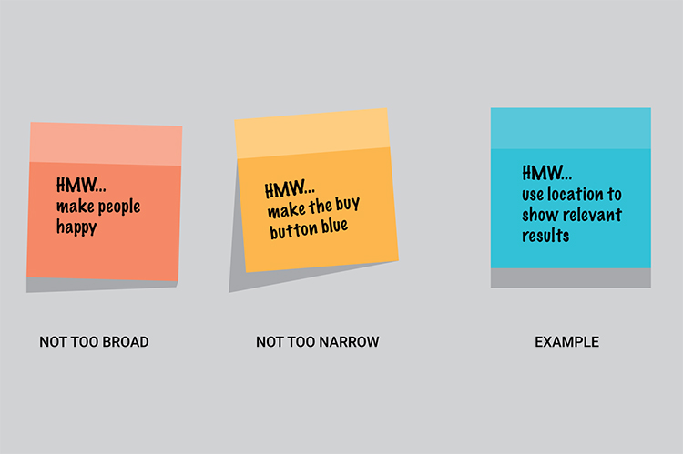

# Using "How Might We... questions

## What
A systematic method for framing your design challenge.

## Why
Every problem is an opportunity for design. By framing your challenge as a How Might We question, you’ll set yourself up for an innovative solution.

## When
Pre-Ideation.

When you need to step back from ideas and return to needs and opportunities.

## How
The goal is to create questions that provoke meaningful and relevant ideas; do so by keeping the questions insightful and nuanced.

- Start with the key pain points, insights or user stories developed in your research activities.
- Look at the individual parts within each insight or user story, and convert each insight or story into several trigger questions, starting with “How might we …”
- Sort and group the questions into useful clusters or “opportunity areas.”
- Look at the questions inside the clusters and decide what stakeholders and/or specialists you should invite to enrich your usual ideation cast of researchers, people who will implement and deliver the service, users, management, etc.
- You're now ready to ideate around the questions inside your most important clusters, then move to idea selection.

> 💡 **TIP:** It’s critical that a How Might We statement allows for a broad set of solutions, but is narrow enough that we know where to start.

It can help to think about HMW's using the following criteria:

- Amp up the good
- Focus on emotions
- Take it to the extreme
- Focus on the opposite
- Question an assumption
- Create an analogy from insight or context
- Focus in on an element

## Expected output
- Trigger questions (text)
- Map of idea clusters

## Who
- Project team
- Stakeholders (if you think it's suitable)
- Specialists (technology, policy, clinicians, etc)

## Links

- IDEO: [How Might We](http://www.designkit.org/methods/3)
- Google ventures: [The “How Might We” Note Taking Method](https://designsprintkit.withgoogle.com/methods/understand/hmw-directions/)
- Mollila: [How might we?](https://toolkit.mozilla.org/method/how-might-we/)
- d.school: ["How Might We" Questions](https://dschool.stanford.edu/resources/how-might-we-questions?rq=how%20might%20we)
  - d.school: [HMW-Worksheet.pdf](../pdfs/HMW-Worksheet.pdf)
